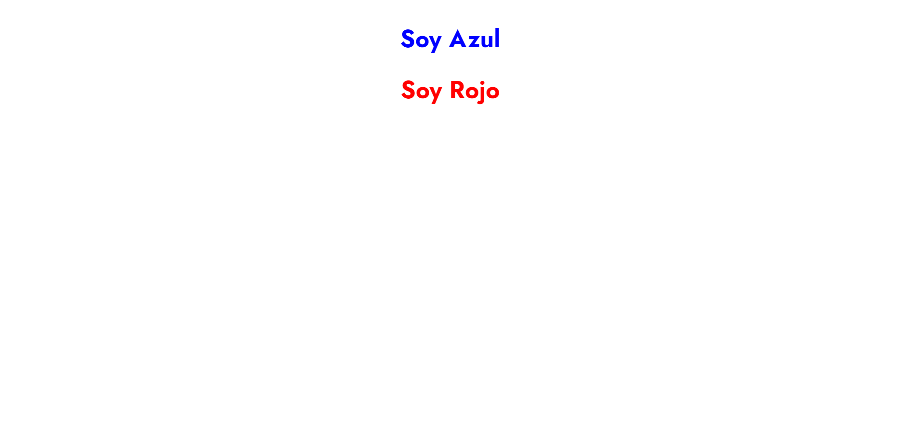
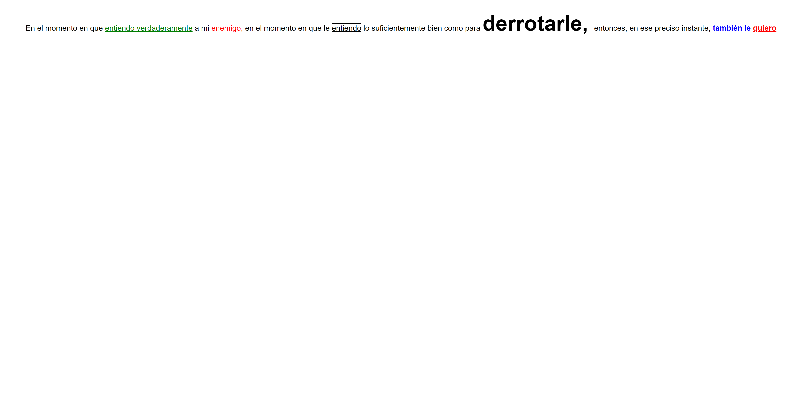
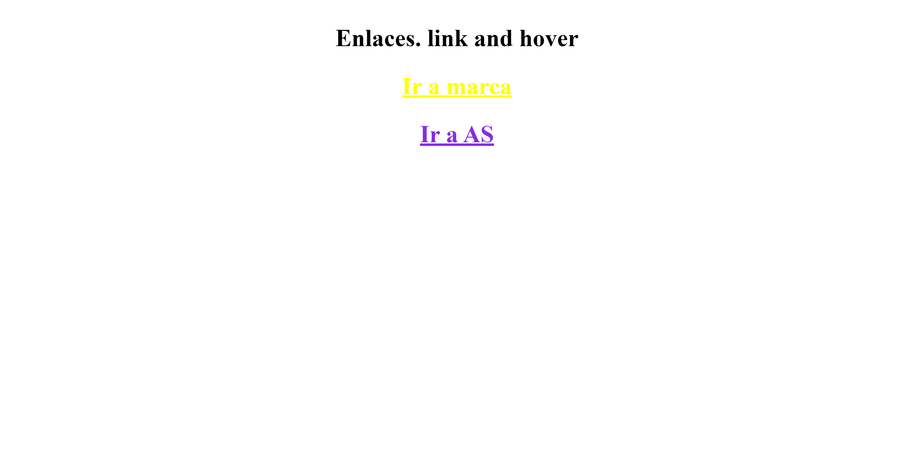
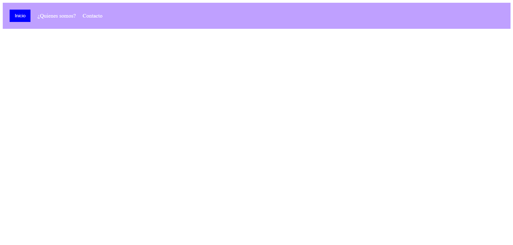
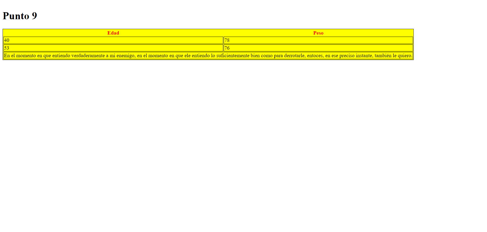

<h1>Taller 9: Omar Penagos</h1>

<h2>información</h2>

Curso: Full Stack Básico -Grupo 1 

Profesor: Cristian Patiño

<h2>Punto 1: Link de figma</h2>
<a href="https://www.figma.com/file/pfkAx51yf3HuhbVuTumAjm/Untitled?type=design&node-id=0%3A1&t=21szEC9eIA8uMjN2-1" target="__blank">Link de Figma</a>
 
<a href="https://0m4rp.github.io/taller-9-full-stack/" target="_blank">Link de la página</a>

<h2>Punto 2: HTML</h2>

<h2>Punto 3: CSS</h2>

<h2>Punto 4: Texto en el navegador</h2>

<h2>Punto 5: Parrafo</h2>

<h2>Punto 6: Enlaces</h2>

<h2>Punto 7-8: Menú </h2>

<h2>Punto 9: Tabla</h2>

